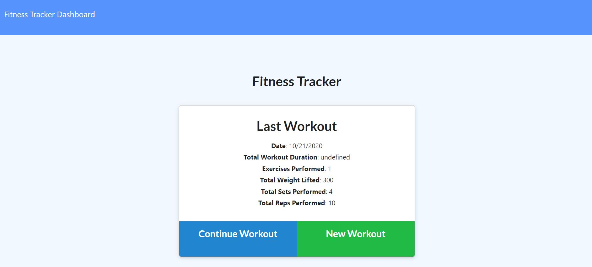
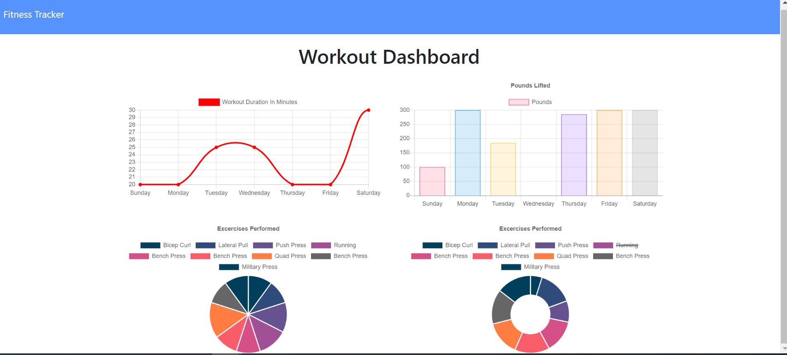

# workout-tracker

### Description

This is a workout logger app that helps you keep track of your workouts that contributes to your health journey.





### Deployed Link

**https://workout-tracker-qo0v.onrender.com**


### Installation

This app is deployed on Render. Once you enter the url, you can choose between a cardio or resistance workout and enter details such as weights, reps, etc. You can also see your overall progress by clicking Dashboard, which is located in the navigation bar.

### Usage

Creating this app involved seed, node.js, mongoose, morgan, and express.

### Contributing

Acknowledgements goes to my TA's and classmate as well as previous activites and google.

### Questions

Questions can be sent to me via Github at:

**https://github.com/hallkr86**

License
```
Copyright 2020 - Kesha Hall

Permission is hereby granted, free of charge, to any person obtaining a copy of this software and associated documentation files (the "Software"), to deal in the Software without restriction, including without limitation the rights to use, copy, modify, merge, publish, distribute, sublicense, and/or sell copies of the Software, and to permit persons to whom the Software is furnished to do so, subject to the following conditions:

The above copyright notice and this permission notice shall be included in all copies or substantial portions of the Software.

THE SOFTWARE IS PROVIDED "AS IS", WITHOUT WARRANTY OF ANY KIND, EXPRESS OR IMPLIED, INCLUDING BUT NOT LIMITED TO THE WARRANTIES OF MERCHANTABILITY, FITNESS FOR A PARTICULAR PURPOSE AND NONINFRINGEMENT. IN NO EVENT SHALL THE AUTHORS OR COPYRIGHT HOLDERS BE LIABLE FOR ANY CLAIM, DAMAGES OR OTHER LIABILITY, WHETHER IN AN ACTION OF CONTRACT, TORT OR OTHERWISE, ARISING FROM, OUT OF OR IN CONNECTION WITH THE SOFTWARE OR THE USE OR OTHER DEALINGS IN THE SOFTWARE.
```